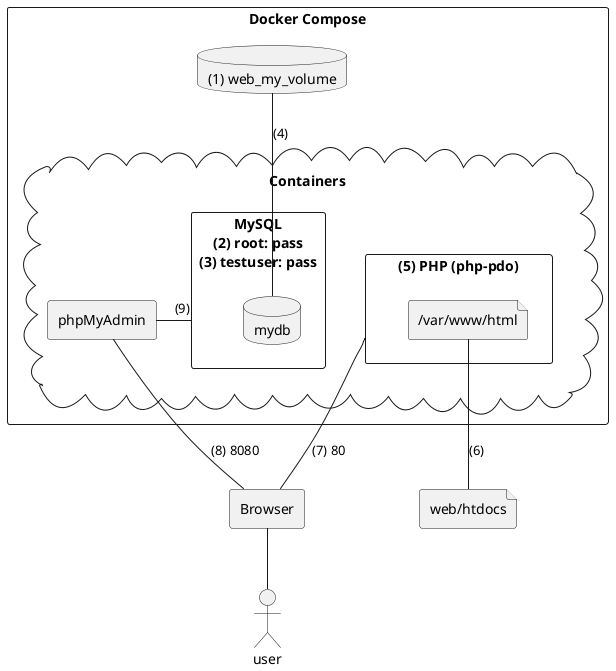

```puml
@startuml
skinparam {
  defaultFontName Hiragino Kaku Gothic ProN
  monochrome true
  shadowing false
}

rectangle Docker as "Docker Compose" {
  cloud containers as "Containers" {
    rectangle php as "(5) PHP (php-pdo)" {
      file html as "/var/www/html"
    }
    rectangle mysql as "MySQL\n(2) root: pass\n(3) testuser: pass" {
      database mydb as "mydb"
    }
    rectangle phpmyadmin as "phpMyAdmin"
  }
  database volume as "(1) web_my_volume"
}
rectangle browser as "Browser"
actor user
file htdocs as "web/htdocs"

user-up-browser
browser-up-php:(7) 80
browser-up-phpmyadmin:(8) 8080

mydb-up-volume:(4)

htdocs-up-html:(6)
phpmyadmin-mysql:(9)

@enduml
```