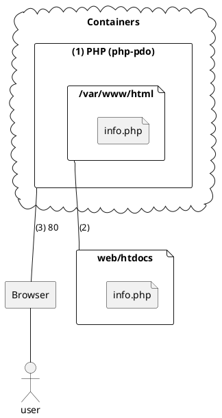

```puml
@startuml
skinparam {
  defaultFontName Hiragino Kaku Gothic ProN
  monochrome true
  shadowing false
}

cloud containers as "Containers" {
  rectangle php as "(1) PHP (php-pdo)" {
    file html as "/var/www/html" {
      file info2 as "info.php"
    }
  }
}

rectangle browser as "Browser"
actor user
file htdocs as "web/htdocs" {
  file info1 as "info.php"
}

user-up-browser
browser-up-php:(3) 80

htdocs-up-html:(2)

@enduml
```
