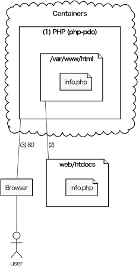

# ウェブアプリ開発環境（Docker）

Dockerの概要は『ゼロからはじめるデータサイエンス入門』（講談社, 2021）などを参照．

## 後片付け

不要なコンテナ，イメージ，ボリュームを削除し忘れてディスクを圧迫しないように，まず，これらの削除方法を確認する．

### コンテナの削除

`docker ps -a`で出てくるコンテナを次のように削除する．（`-f`は動作中のコンテナも強制的に削除するためのオプション．CONTAINER IDは，他と識別できる文字数だけ入力すればよい．）

```bash
docker rm -f コンテナ名
# あるいは
docker rm -f CONTAINER ID
```

すべてのコンテナを削除するなら`docker rm -f $(docker ps -aq)`

### イメージの削除

`docker images`で出てくるイメージを次のように削除する．（`-f`はそのイメージから作られたコンテナがっても強制的に削除するためのオプション．IMAGE IDは，他と識別できる文字数だけ入力すればよい．）

```bash
docker rmi -f REPOSITORY
# あるいは
docker rmi -f IMAGE ID
```

稼働中のコンテナに関わるもの以外の，すべてのイメージとコンテナを削除するなら`docker system prune`

### ボリュームの削除

`docker volume ls`で出てくるボリュームを次のように削除する．

```bash
docker volume rm VOLUME NAME
```

動作中のコンテナに関わらないボリュームを全て削除するなら`docker volume prune`

## コンテナを使う練習

PHPのコンテナを用意し，HTMLファイルを配信する．

1. 適当な場所に「web」という名前のフォルダを作り，それをExplorerで開く．**以下，すべての作業はこのフォルダで行う．**
1. アドレス欄に`bash`と入力し，Enterを押す．（bashが起動し，フォルダwebがカレントディレクトリになる．以下，このウィンドウを**ターミナル**と呼ぶ．コマンドは，このターミナルで入力し，実行する．）
1. フォルダhtdocsとファイルhtdocs/test.txtを作る．

```bash
# ターミナルで実行する．
mkdir htdocs
echo "<?php phpinfo();" > htdocs/info.php
```

次のような構成になる．

```
web                    # すべての作業はこのフォルダで行う．
├── docker-compose.yml # 後でダウンロードするファイル
└── htdocs             # ここにあるファイルがウェブサーバで公開される．
    └── info.php       # 3で作ったファイル．
```

4. ウェブサーバを起動し，info.phpにアクセスする（終了はCtrl-c, Ctrl-c）．

```bash
# ターミナルで実行する．
docker run --rm -it -p 80:80 -v $(pwd)/htdocs:/var/www/html taroyabuki/php-pdo:7.2
```

http://localhost:80/info.php にアクセスして，画面が出てくれば成功．（URLの「:80」はHTTPのデフォルトだから省略可）

ここで作ったコンテナは次のようなものである．

[](php.md)

補足：

1. php-pdo:7.2というイメージをもとにコンテナを作っている．ちなみに，このイメージは，PHP 7.2にMySQLに接続するためのライブラリ（PDO）を追加したものである（[Dockerfile](php-pdo/Dockerfile)）．
2. コンテナのウェブサーバが公開するファイルは/var/www/htmlに置くことになっている．このフォルダはホストのweb/htdocsと同じものである．だから，web/htdocsに置いたファイルがウェブサーバ経由で閲覧できることになる．
3. コンテナのウェブサーバには，ホストのポート80経由でアクセスする．

## 開発の本番

複数のコンテナをまとめて管理する，docker composeを使う．

その設定ファイル[docker-compose.yml](docker-compose.yml)をダウンロードしておく（1回だけ実行すればよい）．**以下，すべての作業はこのdocker-compose.ymlがあるフォルダで行う．**

```bash
# ターミナルで実行する．
wget https://raw.githubusercontent.com/taroyabuki/pmit/master/docker/docker-compose.yml
```

全体の構成は図のとおり（詳細は[docker-compose.yml](docker-compose.yml)を参照）．

[](image.md)

開発環境の起動と停止は次のとおり．

```bash
# ターミナルで実行する．

#起動
docker compose up -d

#停止
docker compose down
```

（稼働中の）コンテナが残っている状態で新たに開発環境を起動しようとすると，次のようなエラーになる（ポートの利用が重複しているということ）．

```
（省略）Bind for 0.0.0.0:8080 failed: port is already allocated
```

こういう場合は開発環境を停止させればいいのだが，それがうまく行かない場合は，`docker ps`で残っているコンテナを確認して，`docker rm`で削除する．削除の際は，コンテナを識別するのに十分なだけCONTAINER IDを入力する．

```bash
# ターミナルで実行する．
docker ps #以下は結果の例
CONTAINER ID   IMAGE                    COMMAND                  CREATED        STATUS        PORTS                  NAMES
8846c6f8a068   taroyabuki/php-pdo:7.2   "docker-php-entrypoi…"   12 hours ago   Up 12 hours   0.0.0.0:80->80/tcp     web-php-1
0865bf577c46   mysql:5.7                "docker-entrypoint.s…"   12 hours ago   Up 12 hours   3306/tcp, 33060/tcp    web-mysql-1
2de8fc0818a3   phpmyadmin/phpmyadmin    "/docker-entrypoint.…"   12 hours ago   Up 12 hours   0.0.0.0:8080->80/tcp   web-phpmyadmin-1
```

上のような結果を見て，削除対象を確認し，削除する．上の，「2de8fc0818a3   phpmyadmin/phpmyadmin・・・」を削除するなら次のとおり．

```bash
# ターミナルで実行する．
docker rm -f 884 086 2de
```

### 開発の概要

- .php, .html, .cssはホストのVS codeで編集する．（VS Codeの拡張機能「Remote Development」を使って，コンテナに接続して編集することもできるが，詳細は割愛）
- ウェブアプリの動作確認は，http://localhost で行う．例えば，練習で作ったinfo.phpには，http://localhost/info.php で閲覧できる．
- MySQLの操作方法：
    - （簡単）[phpMyAdmin](http://localhost:8080)（ユーザ名は`root`，パスワードは`pass`）
    - （慣れた人向け）コンソールを使う：`docker compose exec mysql mysql -uroot -ppass mydb`
- データベースをダンプする方法（mydb.sqlができる）：
    - テーブルを作り直さない場合：`docker compose exec mysql mysqldump -uroot -ppass mydb > mydb.sql`
    - テーブルを作り直す場合：`docker compose exec  mysql mysqldump -uroot -ppass --add-drop-table mydb > mydb.sql`

### 練習

後は[PM演習](https://github.com/taroyabuki/pmpractice2)の順番で勉強していけばいいのだが，最初の方だけやってみる．

ヒント：作業が終わると，フォルダwebの中身は次のようになっている．

```
web
├── docker-compose.yml
└── htdocs
    ├── db.php
    ├── hello-db.php
    ├── info.php
    └── show-all2.php
```

#### PHPとMySQL

[PHPとMySQL](https://github.com/taroyabuki/pmpractice2/blob/master/docs/phpmysql.md)の作業をやってみるのだが，

1. データベースmydbはできている．
1. テーブルtable1を作る．

そのためにMySQLに接続する（[phpMyAdmin](http://localhost:8080)を使ってもよい）．

```bash
# ターミナルで実行する．
docker compose exec mysql mysql -uroot -ppass mydb
```

次のSQLを実行する（詳細は[データベースの操作](https://github.com/taroyabuki/pmpractice2/blob/master/docs/sql.md)を参照）．

```sql
create table table1 (
  id int primary key auto_increment, # ここはいつも同じ
  varcharA varchar(40) not null,
  intA int not null,
  intB int not null # 最後にはカンマがないことに注意．
);

insert into table1 (id, varcharA, intA, intB) values
(1, 'A', 1280, 1),
(2, 'B', 2980, 0),
(3, 'C', 198, 121);

exit
```

3. web/htdocsに，ファイル[db.php](https://github.com/taroyabuki/pmpractice2/blob/master/db.php)を作る．http://localhost/db.php にアクセスして，エラーが表示されないことを確認する．
4. web/htdocsに，ファイル[hello-db.php](https://github.com/taroyabuki/pmpractice2/blob/master/docs/hello-db.php)を作る．http://localhost/hello-db.php にアクセスして，エラーが表示されないことを確認する．

#### 全データ表示（実装）

[全データ表示（実装）](https://github.com/taroyabuki/pmpractice2/tree/master/patterns/show-all)の一部を試す．

5. web/htdocsに，ファイル[show-all2.php](https://github.com/taroyabuki/pmpractice2/blob/master/patterns/show-all/show-all2.php)を作る．http://localhost/show-all2.php でデータが表示されることを確かめる．

後は[PM演習](https://github.com/taroyabuki/pmpractice2)の順番で勉強していけばいい．
