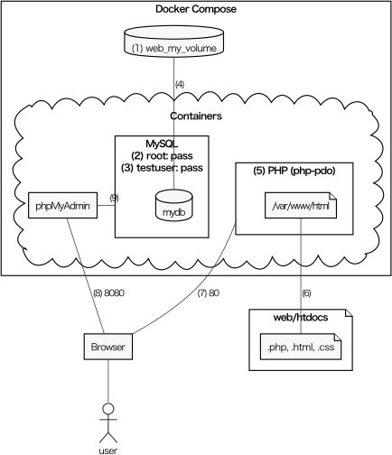

# ウェブアプリ開発環境（Docker）

Dockerの概要は『ゼロからはじめるデータサイエンス入門』（講談社, 2021）などを参照．

## 後片付け

不要なコンテナ，イメージ，ボリュームを削除し忘れてディスクを圧迫しないように，まず，これらの削除方法を確認する．

### コンテナの削除

`docker ps -a`で出てくるコンテナを次のように削除する．（`-f`は動作中のコンテナも強制的に削除するためのオプション）

```bash
docker rm -f コンテナ名
# あるいは
docker rm -f CONTAINER ID
```

すべてのコンテナを削除するなら`docker rm -f $(docker ps -aq)`

### イメージの削除

`docker images`で出てくるイメージを次のように削除する．（`-f`はそのイメージから作られたコンテナがっても強制的に削除するためのオプション）

```bash
docker rmi -f REPOSITORY
# あるいは
docker rmi -f IMAGE ID
```

稼働中のコンテナに関わるもの以外の，すべてのイメージとコンテナを削除するなら`docker system prune`

### ボリュームの削除

`docker volume ls`で出てくるボリュームを次のように削除する．

```bash
docker volume rm VOLUME NAME
```

動作中のコンテナに関わらないボリュームを全て削除するなら`docker volume prune`

## コンテナを使う練習

PHPのコンテナを用意し，HTMLファイルを配信する．

1. 適当な場所に「web」という名前のフォルダを作り，それをExplorerで開く．**以下，すべての作業はこのフォルダで行う．**
1. アドレス欄に`bash`と入力し，Enterを押す．（bashが起動し，フォルダwebがカレントディレクトリになる．）
1. フォルダhtdocsとファイルhtdocs/test.txtを作る．

```bash
mkdir htdocs
echo "<?php phpinfo();" > htdocs/info.php
```

次のような構成になる．

```
web                    # すべての作業はこのフォルダで行う．
├── docker-compose.yml # 後でダウンロードするファイル
└── htdocs             # ここにあるファイルがウェブサーバで公開される．
    └── info.php       # 3で作ったファイル．
```

4. ウェブサーバを起動し，info.phpにアクセスする（終了はCtrl-c, Ctrl-c）．

```bash
docker run --rm -it -p 80:80 -v $(pwd)/htdocs:/var/www/html taroyabuki/php-pdo:7.2
```

http://localhost/info.php にアクセスして，画面が出てくれば成功．ちなみに，taroyabuki/php-pdo:7.2は，PHP 7.2にMySQLに接続するためのライブラリ（PDO）を追加しただけのイメージである（[Dockerfile](php-pdo/Dockerfile)）．

## 開発の本番

複数のコンテナをまとめて管理する，docker composeを使う．

その設定ファイル[docker-compose.yml](docker-compose.yml])をダウンロードしておく（1回だけ実行すればよい）．

```bash
wget https://raw.githubusercontent.com/taroyabuki/pmit/master/docker/docker-compose.yml
```

全体の構成は図のとおり．

[](image.md)

補足説明（詳細は[docker-compose.yml](docker-compose.yml])を参照）

1. Dockerのボリューム`web_my_volume`を作る．
2. MySQLのユーザrootのパスワードは`pass`．
3. データベースmydbにアクセスするユーザ`testuser`のパスワードは`pass`．
4. 1のボリュームにデータベース（mydb）を保存する．ユーザtestはこのデータベースにアクセスできる．
5. PHPのためのイメージはtaroyabuki/php-pdo．
6. ホストのweb/htdocsとコンテナの/var/www/htmlは同じ．
7. localhost:80へのアクセスはPHPに転送される．
8. localhost:8080へのアクセスはphpMyAdminに転送される．
9. phpMyAdminの管理対象はMySQL（参照：https://hub.docker.com/r/phpmyadmin/phpmyadmin/ ）

開発環境の起動と停止は次のとおり．

```bash
#起動
docker compose up -d

#停止
docker compose down
```

### 開発の概要

- .php, .html, .cssはホストのVS codeで編集する．（VS Codeの拡張機能「Remote Development」を使って，コンテナに接続して編集することもできるが，詳細は割愛）
- ウェブアプリの動作確認は，http://localhost で行う．例えば，練習で作ったinfo.phpには，http://localhost/info.php でアクセスできる．
- MySQLの操作方法：
    - [phpMyAdmin](http://localhost:8080)（ユーザ名は`root`，パスワードは`pass`）
    - コンソールを使う：`docker exec -it web-mysql-1 bash -c "mysql -uroot -ppass mydb"`
- データベースをダンプする方法（mydb.sqlができる）：
    - テーブルを作り直さない場合：`docker exec -it web-mysql-1 bash -c "mysqldump -uroot -ppass mydb" > mydb.sql`
    - テーブルを作り直す場合：`docker exec -it web-mysql-1 bash -c "mysqldump -uroot -ppass --add-drop-table mydb" > mydb.sql`

### 練習

[PM演習](https://github.com/taroyabuki/pmpractice2)で練習しよう．
